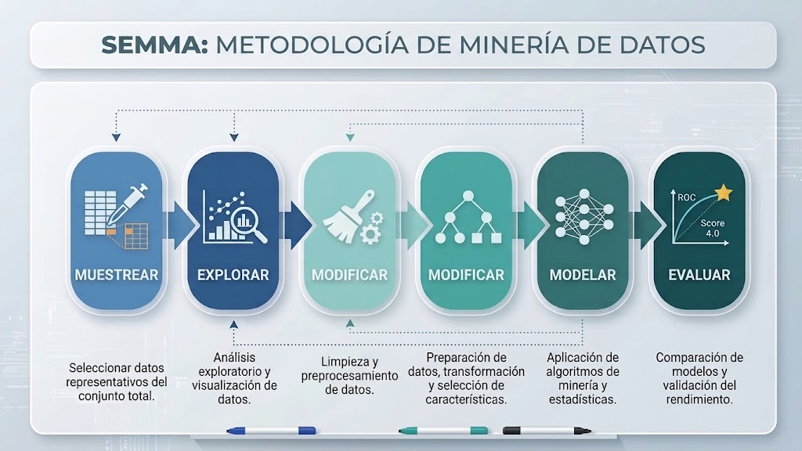
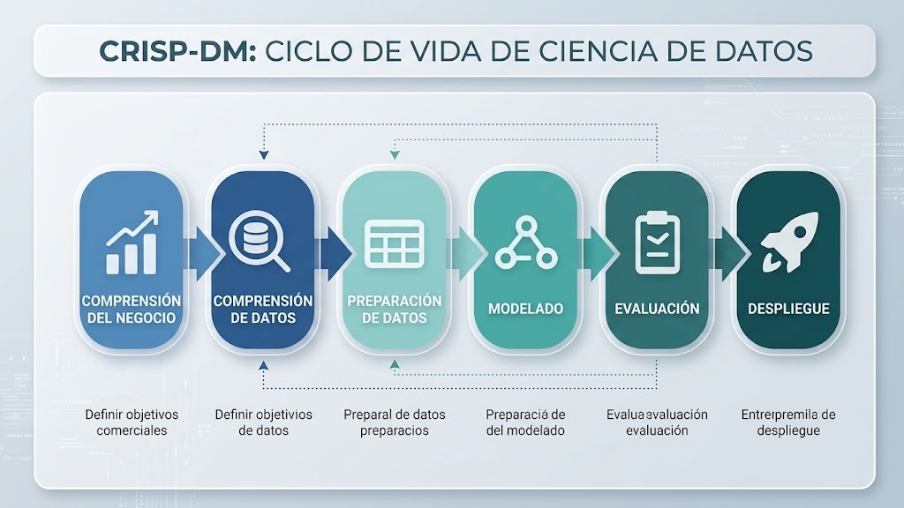

```
------------- ESPECIALIZACIÓN EN INTELIGENCIA ARTIFICIAL Y BIG DATA -------------
---------------------------------------------------------------------------------

Módulo:                     SISTEMAS DE BIG DATA
Profesor:                   Víctor J. González
Unidad de Trabajo:          UT01. INTRODUCCIÓN AL BIG DATA
Apartado:                   5.- Metodologías de minería de datos (SEMMA y CRISP-DM)
Resultados de aprendizaje:  ?
```

# 5. Metodologías de minería de datos: SEMMA y CRISP-DM

En el ámbito del análisis de datos y la minería de datos conviven dos grandes metodologías estándar de trabajo, orientadas a estructurar los proyectos desde diferentes perspectivas:

- **SEMMA**: desarrollada por el SAS Institute, posee un enfoque predominantemente experimental, científico y técnico, estructurado como una tubería cíclica de refinamiento centrada en el desarrollo y ajuste del modelo.
- **CRISP-DM** (*Cross-Industry Standard Process for Data Mining*): es el estándar más adoptado en el ámbito empresarial e industrial, ya que no arranca directamente con los datos, sino con las necesidades estratégicas, los costes y los objetivos del negocio.


# 5.1. Metodología SEMMA

La metodología SEMMA concibe el flujo analítico como una tubería de refinamiento donde se parte de datos en bruto y se concluye con conocimiento evaluado a través de 5 etapas iterativas:




## 5.1.1. Fase Sample (Muestreo)

El objetivo de esta fase es extraer una porción representativa del conjunto de datos original heterogéneo para asegurar la validez futura del modelo, más allá de una partición aleatoria trivial.

Las **tareas** que tienen lugar aquí son:

- **Partición del dataset (70/15/15)**: división de los datos en subconjuntos de entrenamiento (70%), validación (15%) y prueba (15%).
- **Muestreo estratificado**: segmentación por características clave para garantizar la representatividad de clases minoritarias o desbalanceadas.
- **Validación cruzada (*K-Fold Cross-Validation*)**: división en $k$ bloques rotatorios para maximizar el aprovechamiento de datos en muestras reducidas.


## 5.1.2. Fase Explore (Exploración)

En esta fase se busca comprender la naturaleza, forma y calidad de los datos antes del modelado para descubrir anomalías, tendencias y relaciones.

Las **tareas** asociadas son:

- **Análisis univariante**: cálculo de estadística descriptiva (media, mediana, moda, desviación típica, percentiles) y evaluación de asimetría (*skewness*) y curtosis.
- **Visualización de distribuciones**: representación mediante histogramas y curvas de densidad (*KDE*).
- **Auditoría de datos ausentes**: detección y cuantificación de valores nulos tanto en recuentos absolutos como en porcentajes sobre el total.
- **Análisis multivariante**: construcción de matrices de correlación para identificar predictores clave, detectar multicolinealidad y descartar ruido.
- **Gráficos de dispersión (*Scatter plots*)**: inspección visual de la dirección, fuerza y forma de las relaciones (lineales y no lineales), así como detección de valores atípicos (*outliers*).


## 5.1.3. Fase Modify (Modificación)

Aquí se aplican transformaciones matemáticas y lógicas para elevar la calidad de los datos y adaptarlos a las necesidades de los algoritmos.

Sus **tareas** son:

- **Tratamiento de valores nulos**: decisión entre eliminación (de filas o columnas) e imputación (por media, mediana, moda o valor constante).
- **Escalado y normalización**: homogeneización de escalas numéricas mediante normalización Min-Max o estandarización Z-Score.
- **Corrección del sesgo**: aplicación de transformaciones matemáticas (logarítmica $\log(1+x)$ o raíz cuadrada) para aproximar los datos a una distribución normal.
- **Discretización (*Binning*)**: conversión de variables continuas en categorías mediante intervalos de igual ancho o de igual frecuencia.
- **Ingeniería de variables (*Feature Engineering*)**: creación de nuevos atributos a partir de los existentes (cálculo de ratios, extracción de componentes de fechas).
- **Codificación de variables categóricas**: transformación a formato numérico mediante One-Hot Encoding, Ordinal Encoding o Target Encoding.


## 5.1.4. Fase Model (Modelado)

El objetivo principal de esta fase es seleccionar y aplicar las técnicas analíticas, estadísticas o de aprendizaje automático idóneas según la meta planteada.

Las principales **tareas** que tienen lugar aquí son:

- **Selección de la técnica**: elección del tipo de algoritmo en función del problema (clasificación para variables discretas o regresión para variables continuas).
- **Entrenamiento y optimización**: ajuste de los parámetros del modelo sobre los datos preparados.


## 5.1.5. Fase Assess (Evaluación)

Aquí se determina la fiabilidad, utilidad técnica y capacidad de generalización del modelo frente a datos no observados.

Algunas de las **tareas** que se realizan durante la evaluación pueden ser:

- **Diagnóstico de generalización**: detección y control de sobreajuste (*overfitting*) o subajuste (*underfitting*) mediante validación cruzada.
- **Evaluación en problemas de clasificación**: construcción de la matriz de confusión y cálculo de métricas derivadas (exactitud, sensibilidad/recall, especificidad, precisión y valor predictivo negativo).
- **Análisis de curvas ROC y AUC**: evaluación del rendimiento en todos los umbrales de decisión y cálculo del área bajo la curva.
- **Evaluación en problemas de regresión**: medición de la magnitud de los residuos mediante el error absoluto medio (MAE) y la raíz del error cuadrático medio (RMSE).


## 5.2. Metodología CRISP-DM

CRISP-DM contempla el ciclo de vida completo de la minería de datos mediante un proceso iterativo de 6 fases conectadas estrechamente con el negocio:




### 5.2.1. Fase 1: Comprensión del negocio (*Business Understanding*)


El principal objetivo de esta fase es **determinar el problema** que queremos solucionar en la empresa con ciencia de datos.

Las principales **tareas** que podemos encontrar en ella son:

- Determinar los objetivos del negocio.
- Evaluar la situación (inventario de recursos, restricciones, análisis de riesgos y estudio de coste-beneficio).
- Fijar los objetivos de minería de datos (definir qué métrica técnica cuantifica el éxito, por ejemplo, lograr un $RMSE < 10$).
- Elaborar el plan de proyecto detallando cronograma, herramientas y entregables.

La salida de esta fase debería ser un documento que contenga estos 9 bloques clave:

1. *Objetivo de negocio*: problema específico que se busca resolver.
2. *Valor del proyecto*: estimación de beneficio económico, ahorro o retorno de inversión (ROI).
3. *Fuentes de datos*: orígenes de extracción (ERPs, APIs, logs, bases de datos).
4. *Variable objetivo*: definición analítica exacta de lo que se va a predecir.
5. *Calidad y riesgos*: auditoría de sesgos, faltantes y riesgos legales (RGPD).
6. *Preparación y features*: transformaciones e ingeniería de variables previstas.
7. *Modelado*: familia de algoritmos a evaluar.
8. *Evaluación*: alineación entre métricas técnicas (AUC, $R^2$) y métricas de negocio (% de acierto en pedidos, ahorro conseguido).
9. *Despliegue y uso*: vía de integración de las predicciones en la operativa del usuario final.


### 5.2.2. Fase 2: Comprensión de los datos (*Data Understanding*)

En esta fase se trabaja con los datos (adquisición y exploración) para confirmar si tienen la capacidad de resolver las preguntas planteadas en la fase de negocio.

Las principales **tareas** que hay que realizar aquí son:

- **Recolección inicial de datos**: inventariar orígenes (relacionales, archivos planos, APIs, logs), definir un muestreo inicial si el volumen es masivo y documentar incidencias de carga o transferencia.
- **Descripción de los datos**: análisis de metadatos, volumen (recuento de filas y atributos para dimensionar la carga computacional) y tipología de variables (numéricas discretas/continuas y categóricas nominales/ordinales).
- **Exploración de datos (*EDA*)**: búsqueda de estructuras y patrones a tres niveles de complejidad:
    - *Univariante*: resumen estadístico (.describe()), análisis de simetría con histogramas/KDE, conteo de clases y diagramas de caja (*boxplots*) para identificar dispersión y *outliers*.
    - *Bivariante y multivariante*: mapas de calor de correlación, matrices de dispersión y *boxplots* agrupados (cruce entre variables cuantitativas y cualitativas).
    - *Series temporales*: detección de estacionalidades o tendencias temporales mediante gráficos de líneas y análisis de autocorrelación (ACF/PACF).
- **Verificación de la calidad**: detección sistemática de valores ausentes, incoherencias de formato y errores de registro.


### 5.2.3. Fase 3: Preparación de los datos (*Data Preparation*)

En esta fase se construye el conjunto final de datos que se suministrará a los modelos a partir de los datos en bruto; es la etapa que consume mayor tiempo y esfuerzo en el ciclo de vida, bajo el principio *GIGO* (*Garbage In, Garbage Out*).

Sus **tareas** principales son:

- **Selección de datos**: filtrado de columnas (eliminación de variables con varianza cero, exceso de ausentes o sin justificación de negocio), cribado de registros (depuración de subpoblaciones o errores de captura) y diseño de estrategias de muestreo.
- **Limpieza de datos**: imputación o descarte de valores nulos, tratamiento de valores atípicos y armonización de inconsistencias de formato.
- **Construcción de datos (*Feature Engineering*)**: Creación de nuevas variables derivadas, agregación a distintos niveles de granularidad (ej. ventas diarias a mensuales) y transformaciones matemáticas para reducir sesgos.
- **Integración de datos**: fusión de fuentes mediante operaciones de cruce (*joins/merges*), asegurando la coherencia en las unidades de medida combinadas.
- **Formateo de datos**: adaptación de la estructura de las variables a los requisitos de los algoritmos sin alterar su semántica (codificaciones binarias/ordinales, normalizaciones Min-Max o estandarizaciones Z-Score).


### 5.2.4. Fase 4: Modelado (*Modeling*)

Esta fase es la aplicación interactiva y experimental de algoritmos matemáticos para identificar patrones, predecir magnitudes o agrupar observaciones.

Las **tareas** de esta fase son:

- **Selección de la técnica de modelado**: elección del tipo de algoritmo en función del problema fijado en la fase de negocio (clasificación supervisada, regresión numérica o segmentación no supervisada/*clustering*).
- **Generación del plan de prueba**: elección del esquema de validación para monitorizar el comportamiento del modelo (partición simple train/test o validación cruzada K-Fold).
- **Construcción del modelo**: entrenamiento de los algoritmos y exploración de combinaciones óptimas de hiperparámetros.
- **Evaluación técnica del modelo**: cálculo y análisis cuantitativo del desempeño predictivo y calidad matemática del algoritmo.


### 5.2.5. Fase 5: Evaluación (*Evaluation*)

A diferencia de la evaluación matemática de la fase previa, aquí se evalúa la utilidad real del modelo para las operaciones del negocio y el cumplimiento de los objetivos estratégicos.

Entre sus **tareas** destacan:

- **Evaluación de resultados de cara al negocio**: contrastar el modelo contra KPIs empresariales de impacto operativo (ahorro económico, reducción de costes, porcentaje de optimización de procesos), yendo más allá de métricas abstractas como el RMSE o el F1-Score.
- **Revisión del proceso**: auditoría formal de todo el flujo de trabajo previo para descartar sesgos, garantizar la representatividad muestral y verificar que no se haya incurrido en *data leakage* (utilizar indebidamente información futura para predecir el pasado).
- **Determinación de los siguientes pasos**: toma de decisiones colegiada entre tres alternativas posibles:
  - *Aprobación*: paso a la fase de despliegue.
  - *Iteración*: regreso a fases anteriores para corregir problemas de datos o reajustar objetivos modificados.
  - *Cancelación*: descarte del proyecto por falta de predictibilidad técnica o inviabilidad financiera (cuando el coste de implantación supera el beneficio reportado).


### 5.2.6. Fase 6: Despliegue (*Deployment*)

Aquí se traslada el modelo desde el entorno experimental o de laboratorio a los procesos de producción de la empresa para la toma de decisiones continua.

Sus **tareas** son:

- **Planificación del despliegue**: selección del método de consumo y explotación:
  - *Por lotes (Batch)*: ejecución programada periódica (ej. semanal) volcando resultados a bases de datos o reportes estáticos.
  - *En tiempo real (Real-time)*: conexión mediante endpoints y APIs que emiten inferencias instantáneas ante nuevos registros.
  - *Canal de integración*: iIntegración directa en cuadros de mando interactivos (ej. Power BI), aplicaciones móviles o software de gestión empresarial.
- **Planificación de la monitorización y el mantenimiento**:
  - Control del fenómeno de **deriva del modelo (*model drift*)**, por el cual el rendimiento predictivo se degrada debido a los cambios naturales en el comportamiento de los datos reales a lo largo del tiempo.
  - Definición de alarmas automáticas por caída de precisión y diseño de protocolos de reentrenamiento periódico con datos recientes.
- **Producción del informe final**: generación de la documentación formal técnica y de negocio que recoja las conclusiones, limitaciones y guías operativas del proyecto.

