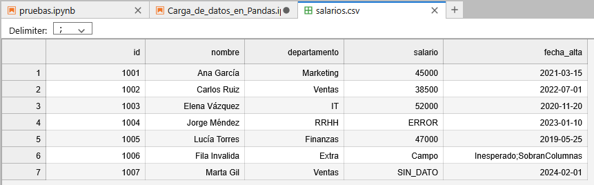
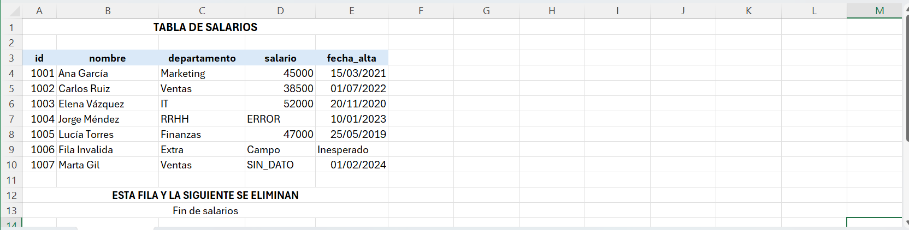

```
------------- ESPECIALIZACIÓN EN INTELIGENCIA ARTIFICIAL Y BIG DATA -------------
---------------------------------------------------------------------------------

Módulo:                     SISTEMAS DE BIG DATA
Profesor:                   Víctor J. González
Unidad de Trabajo:          UT02. PERSISTENCIA DOCUMENTAL, CACHÉ Y PROCESAMIENTO ETL
Apartado:                   1.- Carga de datos con Pandas
Resultados de aprendizaje:  ?
```

# 1.- Carga de datos con Pandas

## 1.1.- Archivos delimitados (CSV/TSV)

Aunque comúnmente llamados CSV (_Comma Separated Values_), son archivos de texto delimitados. Poseen tres componentes:
- **Delimitador:** coma (`,`), punto y coma (`;`, habitual en Europa donde la coma es separador decimal), tabulador (`\t`, seguro frente a colisiones), barra vertical (`|`), secuencias multicarácter (`::`, `~!~`), espacios variables (logs) o caracteres ASCII no imprimibles de control (`\x01` en Apache Hive).
- **Codificación:** `UTF-8` (estándar global compatible con caracteres internacionales y emojis) o `Latin-1` / `ISO-8859-1` / `cp1252` (habitual en entornos legacy y Excel tradicional).
- **Encabezado:** presencia o ausencia de la fila descriptiva con los nombres de columnas.




```python
import io
import pandas as pd

df_csv = pd.read_csv(
    "salarios.csv",                             # Nombre del fichero
    sep=';',                                    # Indicamos el separador del fichero
    header=0,                                   # Número de fila que contiene las columnas
    index_col='id',                             # Qué columna será el índice
    na_values=['ERROR', 'SIN_DATO', '?', '-'],  # Estos valores los convertirá a NaN/None
    on_bad_lines='warn',                        # Si hay una línea con errores avisa, pero sigue leyendo
                                                # La línea con id 1006 (line 7) tiene más campos de lo esperado, por lo que mostará un aviso
    engine='python',                            # Motor de lectura, siempre pondremos este
    parse_dates=['fecha_alta']                  # Activa la conversión de fechas en esta columna
)

print("DataFrame leído:")
print(df_csv)
print("\nTipos inferidos:") # Ya veremos como asignar el tipo correcto a cada columna
print(df_csv.dtypes)
```

    DataFrame leído:
                 nombre departamento  salario fecha_alta
    id                                                  
    1001     Ana García    Marketing  45000.0 2021-03-15
    1002    Carlos Ruiz       Ventas  38500.0 2022-07-01
    1003  Elena Vázquez           IT  52000.0 2020-11-20
    1004   Jorge Méndez         RRHH      NaN 2023-01-10
    1005   Lucía Torres     Finanzas  47000.0 2019-05-25
    1007      Marta Gil       Ventas      NaN 2024-02-01
    
    Tipos inferidos:
    nombre                  object
    departamento            object
    salario                float64
    fecha_alta      datetime64[ns]
    dtype: object


    Skipping line 7: Expected 5 fields in line 7, saw 6


### 1.2 Hojas de Cálculo (Excel)

A diferencia del texto plano, un fichero `.xlsx` es un contenedor comprimido (ZIP) compuesto por archivos XML, estilos, metadatos y varias hojas, lo que demanda librerías auxiliares como `openpyxl` (para `.xlsx`) o `xlrd` (para formatos antiguos `.xls`).




```python
import pandas as pd

# Ejemplo 1: Carga de una hoja concreta saltando filas decorativas (títulos/logos)
df_excel = pd.read_excel(
    'salarios.xlsx',               # Nombre del fichero
    sheet_name='Plantilla_Activa', # Nombre de la hoja
    engine='openpyxl',             # Motor de lectura
    header=2,                      # Encabezados reales ubicados en la fila 3
    usecols='A:E',                 # Limitar lectura a columnas de interés
    skipfooter=2,                  # Omitir filas de totales al pie
    dtype={'ID_Empleado': str}
)

print(df_excel)

# Ejemplo 2: Carga de todas las hojas en un diccionario de DataFrames (ojo que devuelve un diccionario)
# dict_hojas = pd.read_excel('datos_anuales.xlsx', sheet_name=None)
# print("Hojas disponibles:", list(dict_hojas.keys()))
```

           id         nombre departamento   salario           fecha_alta
    0  1001.0     Ana García    Marketing     45000  2021-03-15 00:00:00
    1  1002.0    Carlos Ruiz       Ventas     38500  2022-07-01 00:00:00
    2  1003.0  Elena Vázquez           IT     52000  2020-11-20 00:00:00
    3  1004.0   Jorge Méndez         RRHH     ERROR  2023-01-10 00:00:00
    4  1005.0   Lucía Torres     Finanzas     47000  2019-05-25 00:00:00
    5  1006.0  Fila Invalida        Extra     Campo           Inesperado
    6  1007.0      Marta Gil       Ventas  SIN_DATO  2024-02-01 00:00:00
    7     NaN            NaN          NaN       NaN                  NaN


### 1.3 Formato JSON y JSON Lines

JSON es el estándar dominante en APIs web y bases de datos documentales. Su estructura jerárquica y anidada requiere técnicas de aplanado (_flattening_) para representarse de forma tabular.
- `pd.json_normalize()`: Aplana diccionarios anidados utilizando notación de puntos para las columnas compuestas.
- `record_path` y `meta`: Permiten desplegar listas internas como filas individuales, conservando atributos del nodo padre.
- **JSON Lines (`.jsonl`):** Un objeto JSON completo por línea. Muy eficiente para logs y streaming. Requiere `lines=True`.


```python
import json
import pandas as pd

raw_json = [
    {
        "ciclo": "DAM",
        "curso": "Primero",
        "estudiantes": [
            {"nombre": "Juan", "nota": 8},
            {"nombre": "Lucía", "nota": 9}
        ]
    },
    {
        "ciclo": "ASIR",
        "curso": "Segundo",
        "estudiantes": [
            {"nombre": "Pedro", "nota": 5}
        ]
    }
]

# Normalización: cada elemento de 'estudiantes' es una fila; 'ciclo' y 'curso' se replican
df_alumnos = pd.json_normalize(
    raw_json,
    record_path=['estudiantes'],  # Lista que quieres desglosar en filas, cada elemento una fila
    meta=['ciclo', 'curso']       # Estos datos se repetirán en todas las filas
)
print("Datos normalizados:")
print(df_alumnos)
```

    Datos normalizados:
      nombre  nota ciclo    curso
    0   Juan     8   DAM  Primero
    1  Lucía     9   DAM  Primero
    2  Pedro     5  ASIR  Segundo


En el ejemplo anterior los datos JSON están ya contenidos en una variable. Si fuera necesario cargarlos desde un fichero de disco en formato JSON deberíamos utilizar el siguiente código:

```python
with open('datos.json', 'r', encoding='utf-8') as archivo:
    raw_json = json.load(archivo)
``` 

### 1.4 Formato XML

Formato jerárquico basado en etiquetas que requiere de la librería `lxml` (que debemos instalar si no la tenemos instalada). Se procesa mediante `pd.read_xml()`, navegando la estructura con expresiones **XPath**:

- **Rutas absolutas (`/raiz/nodo`):** recorrido estricto desde la raíz.
- **Rutas relativas (`//nodo`):** localiza el elemento en cualquier profundidad del árbol.
- **Predicados (`//nodo[@attr="valor"]`):** filtra nodos bajo condiciones de atributos específicas.


```python
!pip install lxml
```

    Requirement already satisfied: lxml in /opt/conda/lib/python3.11/site-packages (6.1.3)


```python
import pandas as pd
import io

xml_content = """<?xml version="1.0" encoding="UTF-8"?>
<tienda>
    <seccion nombre="electronica">
        <producto id="A001">
            <nombre>Portátil</nombre>
            <precio>850.00</precio>
        </producto>
        <producto id="A002">
            <nombre>Ratón</nombre>
            <precio>25.00</precio>
        </producto>
    </seccion>
    <seccion nombre="hogar">
        <producto id="B001">
            <nombre>Lámpara</nombre>
            <precio>40.00</precio>
        </producto>
    </seccion>
</tienda>
"""

# Extracción únicamente de los productos pertenecientes a 'electronica'
df_xml = pd.read_xml(
    io.StringIO(xml_content),
    xpath='//seccion[@nombre="electronica"]/producto'
)
print(df_xml)
```

         id    nombre  precio
    0  A001  Portátil   850.0
    1  A002     Ratón    25.0


### 1.5 Ingesta desde APIs REST

Una API REST utiliza HTTP para interactuar con recursos identificados mediante URLs.
- **Métodos principales:** `GET` (lectura), `POST` (creación), `PUT` (actualización), `DELETE` (eliminación).
- **Códigos de estado:** `200` (OK), `400` (Bad Request), `401` (Unauthorized), `404` (Not Found), `500` (Internal Server Error).
- **Mecanismos de autenticación:** según la API, podemos encontrar hasta 4 mecanismos de autenticación.
    - **Sin autenticación:** la API está disponible sin ningún tipo de autenticación
    - **API Key:** token enviado en la _Query String_ de la URL (`params={...}`) o en cabeceras.
    - **Bearer Token:** token criptográfico (habitual en flujos OAuth / JWT) sin estado enviado en la cabecera `Authorization: Bearer <token>`.
    - **Basic Auth:** envío codificado de usuario y contraseña.

#### Ejemplo 1: Consulta sin autenticación ([Star Wars API](https://swapi.dev))


```python
import pandas as pd
import requests

# 1. Hacemos la petición a la API de Star Wars
url = "https://swapi.dev/api/planets"  # URL del endpoint que leemos
response = requests.get(url)

# 2. Convertimos la respuesta a formato JSON (diccionario de Python)
data = response.json()

# 3. Aplanamos la estructura usando json_normalize
# SWAPI devuelve los datos dentro de una lista llamada 'results'
df_planets = pd.json_normalize(data, record_path=["results"])

# 4. Seleccionamos y mostramos algunas columnas relevantes
columnas_interes = ["name", "diameter", "climate", "terrain"]
print(df_planets[columnas_interes].head())
```

           name diameter              climate                             terrain
    0  Tatooine    10465                 arid                              desert
    1  Alderaan    12500            temperate               grasslands, mountains
    2  Yavin IV    10200  temperate, tropical                 jungle, rainforests
    3      Hoth     7200               frozen  tundra, ice caves, mountain ranges
    4   Dagobah     8900                murky                      swamp, jungles


#### Ejemlo 2: Consulta con API Key en la URL ([Open Weather API](https://api.openweathermap.org/))


```python
import requests

# Reemplaza con tu clave obtenida al registrarte en openweathermap.org
API_KEY = "TU_API_KEY_AQUI"
URL = "https://api.openweathermap.org/data/2.5/weather"

# La API Key  (y otros parámetros) los pasamos en la URL (query string)
params = {
    "q": "León",
    "appid": API_KEY,
    "units": "metric",  # Devuelve la temperatura en °C
    "lang": "es"        # Devuelve la descripción en español
}

try:
    # 1. Realizar la solicitud HTTP GET
    response = requests.get(URL, params=params)
    
    # 2. Comprobar que no haya errores (HTTP 4xx o 5xx)
    response.raise_for_status()
    
    # 3. Parsear el resultado a formato JSON (diccionario en Python)
    datos = response.json()
    
    # 4. Extraer los datos relevantes (aquí ya navegamos por los datos JSON devueltos)
    temp = datos["main"]["temp"]
    sensacion = datos["main"]["feels_like"]
    humedad = datos["main"]["humidity"]
    descripcion = datos["weather"][0]["description"]
    
    print(f"--- Tiempo en León ---")
    print(f"Temperatura actual: {temp}°C (Sensación: {sensacion}°C)")
    print(f"Estado: {descripcion.capitalize()}")
    print(f"Humedad: {humedad}%")

except requests.exceptions.HTTPError as error:
    print(f"Error en la petición: {error}")
    # Útil para depurar si la API Key es inválida (código 401)
    if response.status_code == 401:
        print("Verifica que tu API Key sea correcta y esté activada.")
except Exception as e:
    print(f"Error inesperado: {e}")
```

#### Ejemplo 3: Consulta con Bearer Token ([The IMDB (Internet Movie Database)](https://api.themoviedb.org))


```python
import requests
import pandas as pd

BEARER_TOKEN = "TU_BEARER_TOKEN_AQUI"
URL = "https://api.themoviedb.org/3/movie/popular"

# El estándar HTTP requiere el prefijo "Bearer " antes de la clave
# Aquí ponemos el token en los encabezados de la solicitud
headers = {
    "Authorization": f"Bearer {BEARER_TOKEN}",
    "accept": "application/json"
}

# Esta información va en la propia URL
params = {
    "language": "es-ES",
    "page": 1
}

try:
    # 1. Enviamos la petición con los encabezados
    response = requests.get(URL, headers=headers, params=params)
    response.raise_for_status()

    # 2. Obtener el cuerpo de la respuesta en formato JSON
    data = response.json()
    
    # 3. La lista de películas viene dentro de la clave "results"
    lista_peliculas = data.get("results", [])

    # 4. Tabular con pandas seleccionando las columnas de interés
    df_peliculas = pd.DataFrame(lista_peliculas)
    columnas_interes = ["title", "release_date", "vote_average", "popularity"]
    
    print(df_peliculas[columnas_interes].head(10))

except requests.exceptions.HTTPError as error:
    print(f"Error en la petición: {error}")
    if response.status_code == 401:
        print("Token no autorizado o expirado. Revisa la cabecera Authorization.")
except Exception as e:
    print(f"Error inesperado: {e}")
```

### 1.6 Extracción Web (Web Scraping y `read_html`)

- **Técnica:** Obtención programática de información contenida en sitios web.
- **Retos habituales:** Carga de contenido dinámico mediante JavaScript, volatilidad del DOM, bloqueos de IP, resolución de CAPTCHAs y necesidad de respetar `robots.txt` y cabeceras `User-Agent`.
- **Tablas directas:** `pd.read_html()` localiza y procesa etiquetas `<table>` convirtiéndolas en DataFrames de forma automática utilizando como motor `lxml` o `BeautifulSoup`.

### Ejemplo: extraer la lista de películas más taquilleras de la historia


```python
import io
import requests
import pandas as pd

# URL del artículo de Wikipedia
url = "https://es.wikipedia.org/wiki/Anexo:Pel%C3%ADculas_con_las_mayores_recaudaciones"

# Wikipedia requiere un User-Agent identificable para no devolver un error 403
headers = {
    "User-Agent": "Mozilla/5.0 (Windows NT 10.0; Win64; x64) AppleWebKit/537.36"
}

try:
    # 1. Descargar el contenido HTML de la página
    response = requests.get(url, headers=headers)
    response.raise_for_status()

    # 2. Leer todas las etiquetas <table> de la página
    # io.StringIO evita advertencias de depreciación en versiones recientes de Pandas
    tablas = pd.read_html(io.StringIO(response.text))
    
    print(f"Total de tablas encontradas en la página: {len(tablas)}")

    # 3. La tabla principal suele ser la primera (índice 0)
    df_taquilla = tablas[0]

    # 4. Limpieza rápida: mostrar las primeras 5 filas y columnas clave
    print("\nTop 5 películas más taquilleras:")
    print(df_taquilla.head())

except requests.exceptions.HTTPError as err:
    print(f"Error al descargar la página: {err}")
except Exception as e:
    print(f"Ocurrió un error al procesar las tablas: {e}")
```

    Total de tablas encontradas en la página: 7
    
    Top 5 películas más taquilleras:
       N.º                   Película Recaudación mundial Taquilla (en EE. UU.)  \
    0  1.0                     Avatar       2 923 710 708  785 221 649 (26,9 %)   
    1  2.0          Avengers: Endgame       2 799 439 100  858 373 000 (30,7 %)   
    2  3.0  Spider-Man: Brand New Day       2 478 502 286   944 502 286 (38,1%)   
    3  4.0   Avatar: The Way of Water       2 334 484 620  688 459 501 (29,5 %)   
    4  5.0                   Ne Zha 2       2 270 700 370       23 308 176 (1%)   
    
      Taquilla (fuera de EE. UU.)                Presupuesto  \
    0      2 138 484 377 (73,1 %)                246 000 000   
    1      1 941 066 100 (69,3 %)  356 000 000 - 400 000 000   
    2      1 534 000 000 (61,9 %)                225 000 000   
    3      1 646 025 119 (70,5 %)  350 000 000 - 460 000 000   
    4        2 247 392 194 (99 %)                 80 000 000   
    
                                        Distribuidora(s)  Año de estreno  
    0  20th Century Fox (Walt Disney Studios Motion P...          2009.0  
    1                Walt Disney Studios Motion Pictures          2019.0  
    2     Sony Pictures/Marvel Studios/Columbia Pictures          2026.0  
    3                Walt Disney Studios Motion Pictures          2022.0  
    4                           Beijing Enlight Pictures          2025.0  


```python

```
