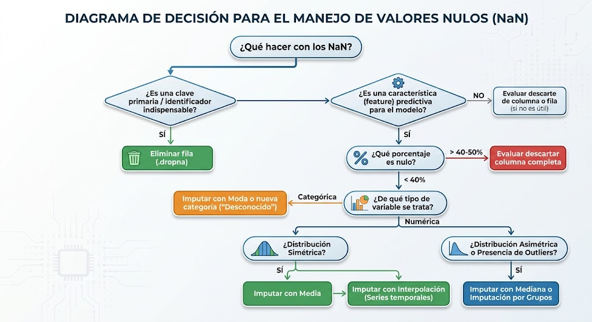

```
------------- ESPECIALIZACIÓN EN INTELIGENCIA ARTIFICIAL Y BIG DATA -------------
---------------------------------------------------------------------------------

Módulo:                     SISTEMAS DE BIG DATA
Profesor:                   Víctor J. González
Unidad de Trabajo:          UT02. PERSISTENCIA DOCUMENTAL, CACHÉ Y PROCESAMIENTO ETL
Apartado:                   2.- Limpieza de datos
Resultados de aprendizaje:  ?
```

# 2.- Limpieza de datos con Pandas


TODO: HAY QUE REVISAR TODO ESTO BIEN


## 2.1. Datos de pruebas: creación del dataset "sucio"

Para comprender el alcance de los problemas habituales, utilizaremos un conjunto de datos que concentra las patologías más frecuentes de fuentes heterogéneas (APIs, logs desestructurados, volcados SQL sin restricciones):

```python
import numpy as np
import pandas as pd

# Fijar semilla para reproducibilidad si se generan datos sintéticos
np.random.seed(42)

raw_data = {
    "cliente_id": [101, 102, 103, 104, 105, 105, 106, 107, 108, 109],
    "nombre": [
        "  Ana Pérez ",
        "Carlos ",
        "BEATRIZ",
        "david",
        "Eva Sanz",
        "Eva Sanz",
        "Fernando Ruiz",
        "Gema",
        "Hugo López",
        "Irene",
    ],
    "edad": [24, "31", np.nan, 45, 29, 29, 150, 38, -5, "cuarenta"],
    "fecha_alta": [
        "2023-01-15",
        "15/02/2023",
        "2023-03-01",
        "sin_fecha",
        "2023-05-10",
        "2023-05-10",
        "2023-06-20",
        "2023-07-12",
        "2023/08/01",
        "N/D",
    ],
    "ingresos_anuales": [
        28000.0,
        34000.5,
        42000.0,
        np.nan,
        31000.0,
        31000.0,
        29000.0,
        850000.0,
        np.nan,
        22000.0,
    ],
    "categoria": [
        "premium",
        " standard",
        "PREMIUM",
        "Standard",
        "basic",
        "basic",
        "desconocido",
        "premium",
        "basic",
        "?",
    ],
    "es_activo": [1, 1, 0, 1, 1, 1, 0, 1, np.nan, 0],
}

df = pd.DataFrame(raw_data)

```


## 2.2. Auditoría y Diagnóstico Estructural (*Data Profiling*)

Antes de modificar un solo registro, es necesario realizar un análisis cuantitativo del estado del DataFrame. En proyectos con millones de filas no es posible examinar los datos visualmente, por lo que necesitamos analizar cada una de las columnas usando Python.

```python
# 1. Resumen estructural: tipos asignados y uso de memoria real
df.info(memory_usage="deep")

# 2. Resumen estadístico de variables numéricas y categóricas
print(df.describe(include="all"))

# 3. Diagnóstico exhaustivo de valores ausentes (conteo y porcentaje relativo)
nulos_resumen = pd.DataFrame(
    {
        "conteo_nulos": df.isna().sum(),
        "porcentaje_nulos": (df.isna().mean() * 100).round(2),
    }
).sort_values(by="porcentaje_nulos", ascending=False)

print(nulos_resumen)

```

Algunas conclusiones que podemos obtener de este estudio:

- **Uso de memoria con `deep=True`:** Pandas por defecto solo inspecciona punteros de memoria para columnas de tipo `object`. Con `deep=True` analiza el tamaño real de las cadenas en memoria RAM, un factor crítico en Big Data.
- **Inconsistencia de tipos:** observa cómo la columna `edad` fue inferida como `object` debido a la presencia combinada de cadenas (`"cuarenta"`), enteros y nulos (`np.nan`).


## 2.3. Integridad de claves y gestión de duplicados

La duplicidad de registros falsea la cardinalidad de los datos e invalida las métricas de evaluación en modelos predictivos. Si un registro idéntico aparece en el conjunto de entrenamiento (*train*) y en el de prueba (*test*), se produce una **fuga de datos**, reportando un rendimiento artificialmente optimista.

Existen dos tipos de duplicados:

1. **Duplicados completos:** todas las columnas contienen exactamente los mismos valores.
2. **Duplicados lógicos o de clave primaria:** registros que repiten el identificador de negocio pero difieren en algún atributo secundario (frecuente en fallos de ingesta o reintentos de red).

```python
# Identificar duplicados completos
print("Duplicados exactos:", df.duplicated().sum())

# Mostrar los registros duplicados completos para inspección previa
filas_duplicadas = df[df.duplicated(keep=False)]
print(filas_duplicadas)

# Eliminación de duplicados completos conservando la primera instancia
df = df.drop_duplicates(keep="first").reset_index(drop=True)

# Validación por clave de negocio: comprobar si hay IDs de cliente repetidos
duplicados_id = df.duplicated(subset=["cliente_id"], keep=False)
if duplicados_id.any():
    print(
        "Alerta: Se detectaron IDs repetidos con datos divergentes:\n",
        df[duplicados_id],
    )
    # Resolución: conservar el registro con información más reciente o más completa
    df = df.drop_duplicates(subset=["cliente_id"], keep="first").reset_index(
        drop=True
    )
```


## 2.4. Coerción de tipos de datos y optimización de memoria

Pandas utiliza tipos de NumPy bajo el capó, pero muchas conversiones requieren control estricto de excepciones para evitar que el proceso falle ante valores no estandarizados.

### Conversión numérica con coerción de excepciones

El parámetro `errors='coerce'` sustituye de forma silenciosa cualquier elemento no convertible por `NaN`.

```python
# Conversión forzada de la columna 'edad'
df["edad"] = pd.to_numeric(df["edad"], errors="coerce")

# Conversión a tipos enteros anulables (Nullable Integer Data Types)
# El tipo nativo int64 de NumPy NO soporta NaN (fuerza float64).
# Pandas introduce 'Int64' (con I mayúscula) para manejar enteros con nulos:
df["edad"] = df["edad"].astype("Int64")
df["es_activo"] = pd.to_numeric(df["es_activo"], errors="coerce").astype(
    "boolean"
)
```

### Estandarización de fechas heterogéneas

En ingestas de Big Data es común recibir fechas en formatos dispares (ISO 8601, formato europeo `DD/MM/YYYY`, marcas de tiempo UNIX o textos inválidos).

```python
# format='mixed' permite procesar múltiples formatos en una misma serie.
# errors='coerce' convierte cadenas inválidas ("sin_fecha", "N/D") en NaT (Not a Time).
df["fecha_alta"] = pd.to_datetime(
    df["fecha_alta"], format="mixed", errors="coerce"
)
```

### Optimización con `CategoricalDtype`

Las columnas de texto con baja cardinalidad (pocos valores únicos repetidos muchas veces) deben convertirse al tipo `category`. En lugar de almacenar cadenas completas en cada fila, Pandas almacena una tabla de enteros (*codes*) vinculados a un diccionario de categorías, reduciendo el consumo de RAM hasta un 80-90%.

```python
# Comparativa conceptual de tipos
print(
    "Consumo de memoria antes (object):",
    df["categoria"].memory_usage(deep=True),
    "bytes",
)
df["categoria"] = df["categoria"].astype("category")
print(
    "Consumo de memoria después (category):",
    df["categoria"].memory_usage(deep=True),
    "bytes",
)
```

## 2.5. Limpieza vectorizada de texto y normalización categórica

El uso de bucles (`for`) o de la función `.apply()` con funciones Python nativas es un antipatrón en Pandas: opera en el intérprete de Python e invalida las optimizaciones vectorizadas de C/Cython. Las operaciones sobre texto deben realizarse siempre a través del accesor `.str`.

```python
# 1. Eliminación de espacios residuales al inicio y final (strip)
df["nombre"] = df["nombre"].str.strip()

# 2. Homogeneización de capitalización (Title Case para nombres propios)
df["nombre"] = df["nombre"].str.title()

# 3. Limpieza de variables categóricas de texto
# Convertir a minúsculas y limpiar espacios para unificar categorías
df["categoria"] = df["categoria"].astype(str).str.strip().str.lower()

# 4. Sustitución de valores centinela por NaN formal
# En muchos sistemas se usan '?', 'desconocido', 'null' o '-1' para representar ausencia de dato.
valores_centinela = ["?", "desconocido", "n/d", "none", "nan"]
df["categoria"] = df["categoria"].replace(valores_centinela, np.nan)

# Re-categorizar tras la homogeneización
df["categoria"] = df["categoria"].astype("category")
```


## 2.6. Tratamiento de valores nulos

El tratamiento de valores faltantes depende de la naturaleza probabilística de la pérdida:

- **MCAR (*Missing Completely at Random*):** la pérdida es independiente de cualquier variable. Eliminar registros suele ser seguro si el volumen es bajo.
- **MAR (*Missing at Random*):** la pérdida depende de otras variables observadas (ej. la probabilidad de no declarar ingresos depende del nivel educativo).
- **MNAR (*Missing Not at Random*):** la falta del dato depende del propio valor ausente (ej. personas con ingresos muy altos o muy bajos evitan declarar sus ingresos). Rellenar con la media introduce un sesgo severo.



```
                                 ¿Qué hacer con los NaN?
                                            │
                  ┌─────────────────────────┴─────────────────────────┐
                  ▼                                                   ▼
         ¿Es una clave primaria /                    ¿Es una característica (feature)
        identificador indispensable?                        predictiva para el modelo?
                  │                                                   │
                  ▼                                                   ▼
       Eliminar fila (.dropna)                         ¿Qué porcentaje es nulo?
                                                 ┌────────────────────┴────────────────────┐
                                                 ▼                                         ▼
                                              > 40-50%                                  < 40%
                                                 │                                         │
                                                 ▼                                         ▼
                                       Evaluar descartar               ¿De qué tipo de variable se trata?
                                        columna completa                 ┌─────────────────┴─────────────────┐
                                                                         ▼                                   ▼
                                                                     Numérica                            Categórica
                                                                         │                                   │
                                                          ┌──────────────┴──────────────┐                    ▼
                                                          ▼                             ▼             Imputar con Moda
                                                     ¿Simétrica?                   ¿Asimétrica/      o nueva categoría
                                                          │                         Outliers?           ('Desconocido')
                                                    ┌─────┴─────┐                       │
                                                    ▼           ▼                       ▼
                                                  Media    Interpolación             Mediana
                                                          (Series temporales)   o Imputación por Grupos

```

### Implementación en código

```python
# Regla 1: Descartar registros donde el identificador o la fecha de alta sean irrecuperables
df = df.dropna(subset=["cliente_id", "fecha_alta"]).reset_index(drop=True)

# Regla 2: Imputación univariante con estadísticos robustos
# Para 'edad', la mediana es más adecuada que la media porque no se distorsiona con valores extremos.
mediana_edad = df["edad"].median()
df["edad"] = df["edad"].fillna(mediana_edad)

# Regla 3: Imputación condicionada por grupos (Group-based Imputation)
# Es más preciso imputar ingresos basándose en la mediana de su categoría de cliente:
df["ingresos_anuales"] = df.groupby("categoria", observed=False)[
    "ingresos_anuales"
].transform(lambda grupo: grupo.fillna(grupo.median()))

# Si queda algún valor residual huérfano (por categorías donde todos los valores eran NaN):
df["ingresos_anuales"] = df["ingresos_anuales"].fillna(
    df["ingresos_anuales"].median()
)

# Regla 4: Imputación categórica mediante creación de clase explícita
# En modelos de Machine Learning, la ausencia de un dato categórico suele tener valor predictivo propio.
df["categoria"] = (
    df["categoria"]
    .cat.add_categories(["no_registrado"])
    .fillna("no_registrado")
)

```


## 2.7. Detección y tratamiento de valores atípicos (*Outliers*)

Un valor atípico puede responder a un error de captura (edad = -5 o 150) o a una variabilidad extrema real (ingresos = 850.000 €). No todos los valores extremos deben eliminarse: descartar anomalías legítimas empobrece la capacidad del modelo para generalizar o para tareas de detección de fraude.

### Método del Rango Intercuartílico (*IQR - Interquartile Range*)

Es el método no paramétrico estándar, inmune a distribuciones no normales.

$$\text{IQR} = Q_3 - Q_1$$

$$\text{Límite Inferior} = Q_1 - 1.5 \times \text{IQR}$$

$$\text{Límite Superior} = Q_3 + 1.5 \times \text{IQR}$$

```python
def calcular_limites_iqr(serie: pd.Series, factor: float = 1.5):
    """Calcula los umbrales de corte para detección de outliers por IQR."""
    q1 = serie.quantile(0.25)
    q3 = serie.quantile(0.75)
    iqr = q3 - q1
    limite_inferior = q1 - (factor * iqr)
    limite_superior = q3 + (factor * iqr)
    return limite_inferior, limite_superior


# 1. Reglas de validación semántica de dominio (Sanity Checks)
# Antes de la estadística, se aplican límites físicos o biológicos obvios:
df.loc[df["edad"] < 0, "edad"] = np.nan
df.loc[df["edad"] > 110, "edad"] = np.nan
# Re-imputar valores corregidos
df["edad"] = df["edad"].fillna(df["edad"].median())

# 2. Detección estadística sobre ingresos
lim_inf_ingresos, lim_sup_ingresos = calcular_limites_iqr(
    df["ingresos_anuales"]
)
print(f"Límites IQR para ingresos: [{lim_inf_ingresos:.2f}, {lim_sup_ingresos:.2f}]")

# Identificar registros fuera de límites
outliers_ingresos = df[
    (df["ingresos_anuales"] < lim_inf_ingresos)
    | (df["ingresos_anuales"] > lim_sup_ingresos)
]
print("Registros anómalos detectados:\n", outliers_ingresos)

```

### Técnicas de Mitigación

Dependiendo del algoritmo final:

1. **Recorte (*Trimming*):** eliminar la fila. Útil si la muestra es masiva y el dato es claramente defectuoso.
2. **Acotamiento (*Winsorization / Capping*):** reemplazar los valores más allá de los umbrales por el valor del umbral superior o inferior. Mantiene el tamaño muestral sin distorsionar la varianza.
3. **Transformación logarítmica:** para distribuciones con asimetría positiva (*right-skewed*), comprimir la escala mediante $\log(1 + x)$.

```python
# Opción: Capping o acotado con .clip()
df["ingresos_anuales_capped"] = df["ingresos_anuales"].clip(
    lower=lim_inf_ingresos, upper=lim_sup_ingresos
)
```


## 2.8. Arquitectura funcional de producción: *Method Chaining* y `.pipe()`

En la industria del software y la ingeniería de datos, el código disperso en celdas de Jupyter Notebook con mutaciones de estado sobre la misma variable (`df['x'] = ...`) es fuente recurrente de fallos silenciosos y dificulta las pruebas unitarias.

El patrón recomendado consiste en componer funciones puras mediante el método `.pipe()`, permitiendo una lectura secuencial idéntica a un pipeline declarativo de datos:

```python
def auditar_claves(data: pd.DataFrame, id_col):
    """Elimina duplicados garantizando unicidad de identificador."""
    return data.drop_duplicates(subset=[id_col], keep="first").copy()


def estandarizar_cadenas(data):
    """Homogeneiza formatos de texto y capitalización."""
    data = data.copy()
    data["nombre"] = data["nombre"].str.strip().str.title()
    data["categoria"] = (
        data["categoria"]
            .astype(str)
            .str.strip()
            .str.lower()
            .replace(["?", "desconocido", "n/d", "none", "nan"], np.nan)
    )
    return data


def transformar_tipos(data):
    """Fuerza tipado correcto con coerción de errores."""
    data = data.copy()
    data["edad"] = pd.to_numeric(data["edad"], errors="coerce")
    data["fecha_alta"] = pd.to_datetime(
        data["fecha_alta"], format="mixed", errors="coerce"
    )
    data["es_activo"] = pd.to_numeric(
        data["es_activo"], errors="coerce"
    ).astype("boolean")
    return data


def tratar_valores_extremos(data):
    """Aplica filtros de dominio y capping a distribuciones numéricas."""
    data = data.copy()
    # Corrección biológica
    data.loc[(data["edad"] < 0) | (data["edad"] > 110), "edad"] = np.nan

    # Winsorization sobre ingresos
    q1 = data["ingresos_anuales"].quantile(0.25)
    q3 = data["ingresos_anuales"].quantile(0.75)
    iqr = q3 - q1
    sup = q3 + (1.5 * iqr)
    inf = q1 - (1.5 * iqr)
    data["ingresos_anuales"] = data["ingresos_anuales"].clip(
        lower=inf, upper=sup
    )
    return data


def imputar_nulos(data):
    """Aplica estrategias de imputación univariante y por contexto."""
    data = data.copy()
    # Descarte de nulos críticos
    data = data.dropna(subset=["fecha_alta"])

    # Imputación de numéricas
    data["edad"] = data["edad"].fillna(data["edad"].median()).astype("Int64")
    data["ingresos_anuales"] = data["ingresos_anuales"].fillna(
        data["ingresos_anuales"].median()
    )

    # Imputación de categóricas
    data["categoria"] = data["categoria"].fillna("no_registrado")
    data["categoria"] = data["categoria"].astype("category")
    return data

```

### Ejecución del pipeline unificado

```python
# Pipeline completo estructurado de forma legible, reproducible y testeable
df_produccion = (
    pd.DataFrame(raw_data)
    .pipe(auditar_claves, id_col="cliente_id")
    .pipe(estandarizar_cadenas)
    .pipe(transformar_tipos)
    .pipe(tratar_valores_extremos)
    .pipe(imputar_nulos)
    .reset_index(drop=True)
)

print(df_produccion.info())
print(df_produccion)

```
