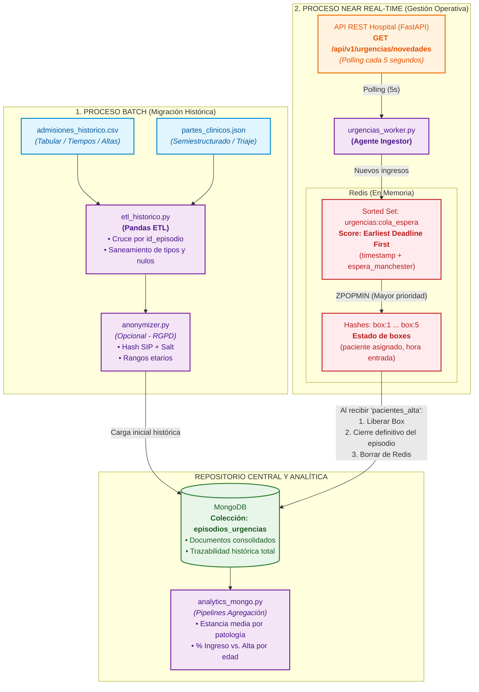
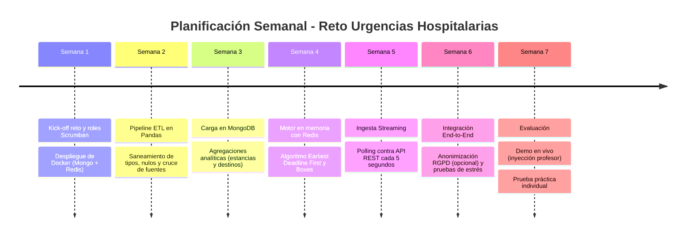

# Reto 1: Modernización y Persistencia Políglota del Sistema de Urgencias Hospitalarias (*CareStream*)

- **Módulo:** Sistemas de Big Data (Curso de Especialización en IA y Big Data)
- **Duración:** 7 semanas (14 horas presenciales de taller + trabajo de equipo)
- **Organización:** Equipos de 3 alumnos bajo metodología *Scrumban*
- **Resultados de Aprendizaje y Criterios evaluados:**
  - **RA 1 (Criterios c, d, f):** Integración de fuentes heterogéneas, construcción de datos complejos y selección de arquitecturas NoSQL.
  - **RA 3 (Criterios a, b, d):** Extracción y almacenamiento políglota, eficiencia en valor analítico, contenerización y seguridad/normativa de datos.


## 1. Contexto del Reto y Misión

La gerencia del Hospital Universitario ha puesto en marcha el proyecto de modernización de su servicio de urgencias. Hasta ahora, el hospital operaba con dos sistemas aislados y heredados:

1. **Sistema de Gestión de Pacientes (Admisiones):** Un volcado relacional plano en CSV con incidencias administrativas, formatos de fecha caóticos y altas clínicas.
2. **Sistema Departamental de Triaje:** Ficheros JSON semiestructurados donde el equipo médico cumplimenta la valoración clínica y constantes vitales con esquemas polimórficos variables.

Para acabar con los problemas de escalabilidad y los tiempos ciegos en la sala de espera, el hospital ha decidido dar dos pasos estratégicos:

* **Fase Batch (Histórico):** Saneamiento, cruce y migración de todos los episodios históricos cerrados hacia una base de datos documental centralizada (**MongoDB**).
* **Fase Near Real-Time (Tiempo Real):** Publicación de las nuevas llegadas y altas a través de una **API REST corporativa**. Estas novedades deben ser absorbidas en tiempo real por un motor de colas en memoria (**Redis**) para gestionar al milisegundo la prioridad de entrada a boxes. Una vez que la API notifica el alta del paciente, su episodio debe quedar consolidado de forma definitiva en MongoDB y desaparecer de la memoria volátil de Redis.

Vuestro equipo de ingeniería de datos debe desplegar la infraestructura, programar los pipelines de migración y construir el agente de ingestión que atienda las admisiones en tiempo real.


## 2. Arquitectura Global de la Solución




## 3. Especificaciones Técnicas del Proyecto

### A. Infraestructura Contenerizada (`docker-compose.yml`)

* **MongoDB (v6.x o superior):** Con volumen persistente montado en disco local y puerto expuesto (`27017`).
* **Redis (v7.x o superior):** Desplegado en el mismo puente de red de Docker y puerto expuesto (`6379`).
* El entorno debe levantarse de forma totalmente reproducible mediante el comando estándar: `docker compose up -d`.

### B. Migración del Histórico (ETL con Pandas $\rightarrow$ MongoDB)

* Limpieza del dataset suministrado (`admisiones_historico.csv` y `partes_clinicos.json`):
* Unificación de fechas heterogéneas (ISO, europeas, timestamps) a formato `datetime` estándar.
* Depuración de anomalías fisiológicas (frecuencias cardíacas negativas o imposibles) y normalización de textos (`destino_alta`).
* Eliminación de duplicados y cruce (*merge*) por la clave unívoca `id_episodio`.


* Persistencia en la colección `episodios_urgencias` de MongoDB.
* **Consultas de Analítica Histórica (Agregaciones en MongoDB):**
1. Tiempo medio de estancia (en minutos) por cada categoría patológica de triaje.
2. Distribución porcentual de destinos al alta (domicilio vs. ingreso en planta) según grupos de edad.


### C. Consumo de la API REST y Motor de Tiempo Real (Redis)

* La API pública del hospital expone el endpoint:
`GET http://<host>:8000/api/v1/urgencias/novedades`
* Vuestro script agente (`urgencias_worker.py`) consultará este endpoint **cada 5 segundos**.

#### Estructura de la Respuesta de la API

```json
{
  "timestamp_consulta": 1727192400.0,
  "total_nuevos": 1,
  "total_altas": 1,
  "nuevos_ingresos": [
    {
      "id_episodio": "EP-2026-50001",
      "datos_admision": {
        "sip_paciente": "SIP-849201",
        "nombre": "Ana García",
        "edad": 62,
        "motivo_consulta": "Dolor torácico opresivo",
        "timestamp_llegada": 1727192395.0,
        "fecha_hora_texto": "2026-09-24 17:39:55"
      },
      "datos_triaje": {
        "nivel_manchester": 2,
        "color": "naranja",
        "categoria_patologia": "Cardiovascular",
        "tiempo_max_espera_min": 10,
        "constantes": { "temperatura_c": 36.8, "frecuencia_cardiaca": 98, "tension_arterial": "140/90" },
        "antecedentes": ["hipertension", "diabetes"],
        "alergias": ["penicilina"],
        "modulo_cardiologia": { "ecg_realizado": true, "troponinas_ng_ml": 0.42 }
      }
    }
  ],
  "pacientes_alta": [
    {
      "id_episodio": "EP-2026-49980",
      "timestamp_alta": 1727192400.0,
      "fecha_hora_alta": "2026-09-24 17:40:00",
      "destino_alta": "domicilio"
    }
  ]
}

```

#### Lógica Operacional en Redis

* **Cola de Triage:** Uso de un *Sorted Set* (`urgencias:cola_espera`). El *score* numérico debe ser el **límite máximo de atención** calculado mediante el algoritmo *Earliest Deadline First*:

$$\text{score} = \text{timestamp\_llegada} + (\text{tiempo\_max\_espera\_min} \times 60)$$


*(El paciente más urgente o con mayor retraso tendrá el score más bajo y será recuperado con `ZPOPMIN`).*
* **Boxes de Atención:** Simular 5 boxes mediante *Hashes* (`box:1`, `box:2`... `box:5`) que registren qué paciente lo ocupa y a qué hora entró.
* **Llegada de un paciente nuevo:** Se guarda temporalmente en Redis y entra en la cola `urgencias:cola_espera`. Si hay un box libre, es asignado de inmediato.
* **Llegada de un alta médica:**
1. Se localiza al paciente en su box de Redis y se libera dicho box.
2. Se extrae al siguiente paciente más urgente de la cola y se sienta en el box liberado.
3. **Cierre en MongoDB:** Se vuelca el documento clínico del paciente que acaba de salir en la colección `episodios_urgencias` con su fecha de alta y destino definitivos, borrándolo por completo de Redis.


## 4. Requisito Opcional: Módulo de Anonimización de Datos (RGPD)

> **Criterio 3.d:** *"Gestión de grandes volúmenes de datos de manera eficiente y segura, teniendo en cuenta la normativa existente"*.

Los equipos que deseen optar a la máxima calificación técnica en el RA3 pueden implementar un módulo de pseudonimización y anonimización previa al volcado en MongoDB:

1. **Ofuscación irreversible del SIP:** Sustituir el `sip_paciente` por un hash truncado generado con salting criptográfico (`HMAC-SHA256`).
2. **Supresión de Identificadores Directos:** Eliminar el campo `nombre` en los datos persistidos o sustituirlo por un identificador anonimizado (`PACIENTE-ANON-XXXX`).
3. **Agrupación por Rangos Etarios:** Transformar la `edad` exacta en grupos demográficos quinquenales o decenales (ej. `[60-69]`) para reducir el riesgo de reidentificación de historiales con patologías raras.


## 5. Planificación y Cronograma de Trabajo (7 Semanas / 14 Horas)



- **Semana 1 (2h):** Lanzamiento del reto. Configuración del tablero Kanban. Creación de `docker-compose.yml` y verificación de conectividad desde Python.
- **Semana 2 (2h):** Construcción del script ETL en Pandas sobre el CSV y JSON históricos. Tratamiento guiado de nulos, atípicos y cruce de datos.
- **Semana 3 (2h):** Carga del histórico depurado en MongoDB con `pymongo`. Implementación de las 2 consultas de agregación analítica.
- **Semana 4 (2h):** Algoritmia de colas con Redis. Implementación de funciones para encolar pacientes (*Earliest Deadline First*) y asignación a boxes.
- **Semana 5 (2h):** Conexión con la API REST. Implementación del bucle de sondeo cada 5 segundos y procesamiento de las listas de altas e ingresos.
- **Semana 6 (2h):** Integración completa (API $\rightarrow$ Redis $\rightarrow$ Box $\rightarrow$ Mongo). Pruebas de estrés e incorporación del módulo opcional de anonimización.
- **Semana 7 (2h):** **Evaluación:**
  - *Primera hora (50 min):* Demostraciones en vivo por equipos (inyección de emergencias en directo).
  - *Segunda hora (50 min):* Prueba práctica individual en máquina.


## 6. Estructura del Repositorio y Entregables

Cada equipo debe entregar un único repositorio Git organizado:

```text
├── docker/
│   └── docker-compose.yml        # Orquestación de MongoDB y Redis
├── src/
│   ├── config.py                 # Variables de entorno y cadenas de conexión
│   ├── etl_historico.py          # Script de migración batch inicial a Mongo
│   ├── triage_redis.py           # Funciones de lógica de colas y boxes en Redis
│   ├── urgencias_worker.py       # Agente de polling continuo contra la API
│   ├── analytics_mongo.py        # Pipelines de agregación analítica
│   └── anonymizer.py             # (Opcional) Funciones de anonimización/RGPD
├── data/
│   ├── admisiones_historico.csv  # Fuentes de datos iniciales
│   └── partes_clinicos.json
├── requirements.txt              # Dependencias fijadas (pandas, pymongo, redis, requests)
└── README.md                     # Guía clara de despliegue y ejecución paso a paso

```


## 7. Rúbrica de Evaluación y Definition of Done (DoD)

La calificación del reto combina el producto técnico del equipo y el desempeño individual:

| Criterio Evaluado                                         | Nivel Excelente (9 - 10)                                                                                                          | Nivel Aceptable (5 - 8)                                                                                             | No Apto (0 - 4)                                                                                 |
| --------------------------------------------------------- | --------------------------------------------------------------------------------------------------------------------------------- | ------------------------------------------------------------------------------------------------------------------- | ----------------------------------------------------------------------------------------------- |
| **Persistencia Políglota y Docker (RA 1.f, 3.a, 3.d)**    | Contenedores estables; MongoDB y Redis utilizados según su fortaleza técnica. Datos migrados sin redundancias ni bloqueos.        | Los servicios levantan pero se aprecian errores de consistencia en el volcado de datos o dependencias sueltas.      | El despliegue falla en limpio o no se justifica el uso diferencial de Mongo y Redis.            |
| **Integración y ETL (RA 1.c, 1.d, 3.b)**                  | Pipeline en Pandas robusto ante errores de formato. Merge limpio por `id_episodio`. Agregaciones analíticas correctas.            | Se cargan los datos pero el script falla si se introducen anomalías nuevas o la consulta de agregación es inexacta. | Faltan campos críticos, no se resuelven duplicados o el cruce de fuentes es erróneo.            |
| **Tiempo Real y Algoritmia (RA 1.c, 3.a)**                | Polling fluido sin saturar la red. Algoritmo *Earliest Deadline First* preciso. Asignación y vaciado de boxes automático al alta. | El polling funciona pero el cálculo de prioridad no gestiona adecuadamente los tiempos o falla al liberar boxes.    | La cola no prioriza según la escala Manchester o el worker se bloquea ante fallos de conexión.  |
| **Seguridad y RGPD (RA 3.d) [Opcional]**                  | Implementación de anonimización reversible/irreversible (hashing con salt y agrupación etaria) justificada en memoria técnica.    | Hashing simple sin salt o eliminación básica de nombres sin considerar otros identificadores indirectos.            | No implementado (no penaliza si el resto es excelente, pero no opta al tramo superior de nota). |
| **Prueba Práctica Individual en Máquina (45% nota ind.)** | Modificación en vivo del código o resolución de una consulta nueva en Mongo/Redis en tiempo tasado sin asistencia externa.        | Resuelve la mayor parte de la prueba con errores sintácticos menores.                                               | Incapaz de manipular o explicar el código presentado por el equipo.                             |