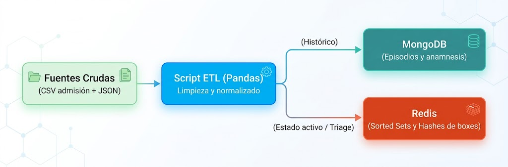

# Reto 1: Sistema de triaje y trazabilidad de urgencias hospitalarias

## 1. Contexto

El Servicio de Urgencias de la red hospitalaria sufre episodios recurrentes de congestión. Actualmente conviven dos problemas críticos:

1. **Pérdida de rendimiento en admisión:** los historiales clínicos se reciben en formatos dispares (partes de ambulancias en JSON semiestructurado y registros de admisión en CSV con esquemas inconsistentes), provocando caídas en las bases relacionales tradicionales por bloqueos de tabla.
2. **Retrasos en la priorización de pacientes:** el personal de triaje necesita determinar al milisegundo qué paciente debe entrar a box según la [escala Manchester](https://www.inesalud.com/actualidad-sanitaria/investigacion/triaje-manchester) (Nivel 1: Resucitación inmediata $\rightarrow$ Nivel 5: No urgente), balanceando gravedad y tiempo de espera acumulado.

Vuestro equipo de ingeniería de datos debe diseñar, desplegar y validar un prototipo funcional que resuelva:

- La ingesta políglota de fuentes diversas (JSON y CSV)
- Almacene el histórico clínico y gestione la cola de espera en tiempo real.


## 2. Requisitos técnicos y arquitectura del sistema

El sistema debe operar íntegramente de forma reproducible mediante Docker y componerse de los siguientes módulos:




### Infraestructura (`docker-compose.yml`)

El sistema estará compuesto por un entorno multi-contenedor con los siguientes servicios:

- Un servicio para **MongoDB** (con persistencia montada en volumen).
- Un servicio para **Redis**.
- Un contenedor opcional para la ejecución de scripts Python con dependencias (`pandas`, `pymongo`, `redis`).


### Módulo ETL (`etl_pipeline.py`):

El módulo ETL (Extract-Transform-Load) deberá estar implementado en Python y realizar las siguientes acciones:

- Ingesta de los dos datasets crudos suministrados.
- Detección y tratamiento explícito de: fechas en formatos incompatibles, duplicados en identificadores de paciente (`SIP`), valores de constantes vitales corruptos (ej. frecuencias cardíacas negativas) y valores nulos en campos clínicos críticos.
- Formateo de los datos depurados para su inserción masiva.

Los datos se facilitarán mediante dos ficheros: uno está generado por la aplicación de **admisión** en urgencias y el otro contiene los datos obtenidos al realizar el **triaje** del paciente.


### Almacenamiento de datos

**Almacenamiento en base de datos documental (MongoDB)**

Aprovecharemos la capacidad de las bases de datos documentales para almacenar **datos semi-estructurados** para almacenar toda la información relativa a cada paciente.

El elemento principal será la colección `episodios_urgencias` donde cada documento debe representar el paso completo de un paciente por el servicio, soportando atributos variables (un paciente traumatológico tiene campos de radiología que no existen en un paciente pediátrico).

Las consultas que ser realizan habitualmente y que debes implementar en un script Python son:

  1. Tiempo medio de estancia en urgencias agrupado por patología de triaje.
  2. Porcentaje de derivaciones a planta (ingreso hospitalario) vs. alta domiciliaria por grupo de edad.


**Almacenamiento en base de datos en memoria (Redis)**

De forma paralela al almacenamiento de los datos en MongoDB necesitaremos los datos necesarios para atender rápidamente a los pacientes en función de su gravedad y hacer un seguimiento de la asignación de boxes. Para esto utilizaremos la base de datos **Redis**.

Almacenaremos dos tipos de datos:

-  **Cola de triaje:** el tipo *Sorted Set* de Redis es ideal para almacenar datos ordenados por un campo (`score`). El `score` numérico debe calcularse algorítmicamente ponderando el nivel de gravedad Manchester (1 a 5, donde 1 es máxima prioridad) y los minutos transcurridos desde la admisión.
- **Gestión de Boxes:** uso de *Hashes* (`box:1`, `box:2`, etc.) para controlar en tiempo real qué paciente ocupa cada box, médico asignado y hora de entrada.

Para gestionar estos datos debes implementar las siguientes funciones operativas mínimas:
- `admitir_paciente(id_paciente, nivel_manchester)`: Encola al paciente con su prioridad calculada.
- `llamar_siguiente_paciente(id_box)`: Extrae de forma atómica al paciente más prioritario y le asigna el box correspondiente.
- `liberar_box(id_box)`: Vía de salida que actualiza el historial en MongoDB y deja el box disponible.


## 3. Fuentes de datos facilitadas

En el repositorio base del reto encontraréis dos ficheros con datos sintéticos sucios:

1. `admisiones_historico.csv`: contiene 50.000 registros con campos: `id_episodio`, `sip_paciente`, `timestamp_llegada`, `motivo_consulta`, `frecuencia_cardiaca`, `tension_arterial`, `destino_alta`.
2. `partes_clinicos.json`: contiene 15.000 documentos semiestructurados con datos de constantes complementarias, antecedentes personales, alergias y notas médicas en texto libre.

A continuación se muestra un extracto de la información disponible en el fichero `admisiones_historico.csv`:

```csv
id_episodio,sip_paciente,timestamp_llegada,motivo_consulta,frecuencia_cardiaca,tension_arterial,destino_alta
EP-2026-0001,SIP-849201,2026-10-04 08:14:22,Dolor torácico opresivo,98,140/90,ingreso_planta
EP-2026-0002,SIP-110293,04/10/2026 08:19:05,Caída casual con traumatismo en tobillo,74,120/80,domicilio
EP-2026-0003,SIP-554812,2026-10-04T08:22:11Z,Disnea progresiva y tos,-25,160/95,ALTA_DOMICILIO
EP-2026-0004,SIP-992381,2026-10-04 08:31:00,Cefalea intensa súbita,82,,observacion
EP-2026-0002,SIP-110293,04/10/2026 08:19:05,Caída casual con traumatismo en tobillo,74,120/80,domicilio
EP-2026-0005,SIP-334190,2026-10-04 08:45:50,Fiebre persistente en lactante,145,90/60,ingreso_pediatria
EP-2026-0006,SIP-772183,2026/10/04 08:52:10,Dolor abdominal difuso,999,135-85,Domicilio
EP-2026-0007,SIP-002914,04-10-2026 09:03:15,Reacción alérgica cutánea,88,115/75,null
EP-2026-0008,SIP-663201,NULL,Lipotimia con recuperación,0,85/50,alta
```
Como puedes observar, tiene una serie de problemas que deberás detectar y sanear, como pueden ser:

- Fechas heterogénes
- Registros duplicados
- Valores fisiológicos imposibles (p.e. frecuencia cardiaca negativa)
- Formatos de tensión arterial inconsistente
- Categorías sucias (columna `destino_alta`)

En cuanto al fichero `partes_clinicos.json`, tiene una estructura similar a la siguiente:

```json
[
  {
    "_id_parte": "CLIN-2026-0001",
    "id_episodio": "EP-2026-0001",
    "sip_paciente": "SIP-849201",
    "edad": 62,
    "triaje_manchester": {
      "nivel": 2,
      "color": "naranja",
      "tiempo_max_espera_min": 10
    },
    "constantes": {
      "saturacion_o2": 94,
      "temperatura_c": 36.8,
      "glucemia_mg_dl": 145
    },
    "antecedentes": ["hipertension", "diabetes_tipo_2", "dislipemia"],
    "alergias": ["penicilina"],
    "modulo_cardiologia": {
      "ecg_realizado": true,
      "ritmo": "sinusal",
      "troponinas_ng_ml": 0.42,
      "dolor_irradiado": true
    },
    "notas_triaje": "Paciente refiere opresión retroesternal iniciada en reposo hace 45 min."
  },
  {
    "_id_parte": "CLIN-2026-0002",
    "id_episodio": "EP-2026-0002",
    "sip_paciente": "SIP-110293",
    "edad": 28,
    "triaje_manchester": {
      "nivel": 4,
      "color": "verde",
      "tiempo_max_espera_min": 120
    },
    "constantes": {
      "saturacion_o2": 99,
      "temperatura_c": 36.4
    },
    "antecedentes": [],
    "alergias": null,
    "modulo_traumatologia": {
      "zona_afectada": "maleolo_peroneo_derecho",
      "deformidad_evidente": false,
      "requiere_rx": true,
      "inmovilizacion_previa": false
    },
    "notas_triaje": "Torsión de tobillo bajando escaleras. Apoyo doloroso pero posible."
  },
  {
    "_id_parte": "CLIN-2026-0005",
    "id_episodio": "EP-2026-0005",
    "sip_paciente": "SIP-334190",
    "edad": 1,
    "triaje_manchester": {
      "nivel": 3,
      "color": "amarillo",
      "tiempo_max_espera_min": 60
    },
    "constantes": {
      "saturacion_o2": 97,
      "temperatura_c": 39.2
    },
    "alergias": ["desconocidas"],
    "modulo_pediatria": {
      "peso_kg": 10.4,
      "alimentacion_tolerada": false,
      "convulsion_febril_previa": false,
      "vacunacion_al_dia": true
    },
    "notas_triaje": "Lactante irritable, pico febril de 39.2 tras antitérmico oral."
  },
  {
    "_id_parte": "CLIN-2026-0006",
    "id_episodio": "EP-2026-0006",
    "sip_paciente": "SIP-772183",
    "edad": 45,
    "triaje_manchester": {
      "nivel": 3,
      "color": "amarillo",
      "tiempo_max_espera_min": 60
    },
    "constantes": {
      "temperatura_c": 37.9
    },
    "antecedentes": ["apendicectomia_2015"],
    "notas_triaje": "Dolor en fosa ilíaca derecha de 12h de evolución. Blumberg dudoso."
  }
]
```

Algunas cosas que puedes observar de estos datos:

- Está relacionado con los datos de admisión mediante el campo `id_episodio`
- No todos los episodios tienen la misma estructura, por ejemplo, los pacientes cardiológicos incorporan el subdocumento `modulo_cardiologia` mientras que los traumatológicos tienen `modulo_traumatologia`.
- Hay campos ausentes o heterogéneos. Por ejemplo, en `constantes` hay pacientes que carecen de `saturacion_o2` o `glucemia_mg_dl`.


## 4. Hitos de entrega y criterios de aceptación

| Hito  | Semana | Fecha límite | Entrega                                                                                                                                                                                                                                                                                                                                                                    |
| ----- | ------ | ------------ | -------------------------------------------------------------------------------------------------------------------------------------------------------------------------------------------------------------------------------------------------------------------------------------------------------------------------------------------------------------------------- |
| **1** | 2      | `xx/xx/2026` | Archivo `compose.yml` validado que levanta los servicios sin errores.<br> Script de Pandas que procesa los dos archivos crudos, genera un informe con los registros descartados/corregidos y exporta los datos limpios                                                                                                                                                     |
| **2** | 4      | `xx/xx/2026` | Colección de MongoDB poblada mediante script automatizado con índices adecuados.<br> Implementación de los scripts de Redis para encolar y desencolar pacientes según la prioridad algorítmica.                                                                                                                                                                            |
| **3** | 6      | `xx/xx/2026` | Repositorio Git estructurado (`/docker`, `/src`, `/docs`).<br> `README.md` con instrucciones exactas para ejecutar el pipeline de extremo a extremo con un único comando.<br> Demostración en vivo de 10 minutos ante el aula simulando una llegada masiva de 20 pacientes con diferentes niveles de triaje y visualizando el vaciado correcto de la cola hacia los boxes. |

